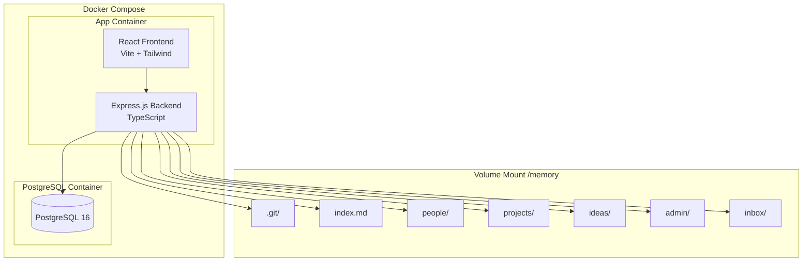

# Design Document: Project Setup

## Overview

This design document describes the foundational architecture for the JustDo.so application - a self-hosted, AI-powered personal knowledge management system. The project-setup spec establishes the monorepo structure, Docker containerization, backend/frontend foundations, database schema, markdown entry system with YAML frontmatter, git integration, and index generation.

The system follows a clean separation of concerns:
- **Memory**: Markdown files with YAML frontmatter stored in `/memory` volume
- **Compute**: Express.js backend with Prisma ORM
- **Interface**: React frontend with Tailwind CSS

## Architecture



### Monorepo Structure

The project code and data directory are intentionally separate:
- **Project code**: Lives in its own git repository, pushed to GitHub
- **Data directory**: Lives outside the project, has its own git repo for versioning, not pushed to GitHub (local-only knowledge base)

```
# Project code (GitHub repo)
justdo/
├── docker-compose.yml
├── package.json                 # Workspace root
├── .env.example
├── frontend/
│   ├── package.json
│   ├── vite.config.ts
│   ├── tailwind.config.js
│   ├── tsconfig.json
│   ├── index.html
│   └── src/
│       ├── main.tsx
│       ├── App.tsx
│       └── components/
├── backend/
│   ├── package.json
│   ├── tsconfig.json
│   ├── Dockerfile
│   ├── prisma/
│   │   └── schema.prisma
│   └── src/
│       ├── index.ts
│       ├── config/
│       │   └── env.ts
│       ├── middleware/
│       │   └── auth.ts
│       ├── routes/
│       │   ├── health.ts
│       │   └── entries.ts
│       ├── services/
│       │   ├── entry.service.ts
│       │   ├── git.service.ts
│       │   └── index.service.ts
│       └── types/
│           └── entry.types.ts

# Data directory (separate location, local git repo only)
# Configured via DATA_PATH environment variable
# Default: ~/justdo-memory or /path/to/your/memory
${DATA_PATH}/
├── .git/                        # Local git repo (not pushed to GitHub)
├── index.md
├── people/
├── projects/
├── ideas/
├── admin/
└── inbox/
```

### Data Directory Configuration

The data directory location is configured via the `DATA_PATH` environment variable in `.env`:

```env
# Example configurations:
DATA_PATH=~/justdo-memory           # Home directory
DATA_PATH=/mnt/data/justdo        # Custom mount point
DATA_PATH=/var/lib/justdo         # System directory
```

In Docker Compose, this is mounted as a volume:

```yaml
volumes:
  - ${DATA_PATH:-./memory}:/memory
```

This separation ensures:
1. Project code can be version-controlled and shared via GitHub
2. Personal knowledge data stays private and local
3. Data can be backed up independently (just copy the folder)
4. Data persists across project code updates

## Components and Interfaces

### Backend Components

#### 1. Environment Configuration (`config/env.ts`)

```typescript
interface EnvConfig {
  // Required
  OPENAI_API_KEY: string;
  DATABASE_URL: string;
  API_KEY: string;
  DATA_PATH: string;             // Path to memory directory (mounted at /memory in container)
  
  // Optional with defaults
  TIMEZONE: string;              // default: 'Europe/Berlin'
  CONFIDENCE_THRESHOLD: number;  // default: 0.6
  PORT: number;                  // default: 3000
}

function loadEnvConfig(): EnvConfig;
function validateRequiredEnvVars(): void;  // throws if missing
```

#### 2. Authentication Middleware (`middleware/auth.ts`)

```typescript
interface AuthMiddleware {
  (req: Request, res: Response, next: NextFunction): void;
}

// Validates Bearer token against API_KEY
// Returns 401 if missing or invalid
function authMiddleware(): AuthMiddleware;
```

#### 3. Entry Service (`services/entry.service.ts`)

```typescript
interface EntryService {
  create(category: Category, data: CreateEntryInput): Promise<Entry>;
  read(path: string): Promise<Entry>;
  update(path: string, updates: UpdateEntryInput): Promise<Entry>;
  delete(path: string): Promise<void>;
  list(category?: Category, filters?: EntryFilters): Promise<EntrySummary[]>;
}

type Category = 'people' | 'projects' | 'ideas' | 'admin' | 'inbox';

interface EntryFilters {
  status?: string;
}
```

#### 4. Git Service (`services/git.service.ts`)

```typescript
interface GitService {
  initialize(): Promise<void>;
  commit(message: string, files: string[]): Promise<string>;  // returns commit hash
  isInitialized(): Promise<boolean>;
}

// Commit message format helpers
function formatCreateCommit(category: Category, name: string, confidence: number, channel: string): string;
function formatUpdateCommit(category: Category, name: string, changeSummary: string, channel: string): string;
function formatDeleteCommit(category: Category, name: string, channel: string): string;
```

#### 5. Index Service (`services/index.service.ts`)

```typescript
interface IndexService {
  regenerate(): Promise<void>;
  getIndexContent(): Promise<string>;
}

// Generates markdown index with tables for each category
// Called after every entry create/update/delete
```

### Frontend Components

#### 1. API Client (`services/api.ts`)

```typescript
interface ApiClient {
  setAuthToken(token: string): void;
  health(): Promise<HealthResponse>;
  entries: {
    list(category?: Category, filters?: EntryFilters): Promise<Entry[]>;
    get(path: string): Promise<Entry>;
    create(category: Category, data: CreateEntryInput): Promise<Entry>;
    update(path: string, updates: UpdateEntryInput): Promise<Entry>;
    delete(path: string): Promise<void>;
  };
  index: {
    get(): Promise<string>;
  };
}
```

### API Routes

| Method | Endpoint | Description |
|--------|----------|-------------|
| GET | `/api/health` | Health check (no auth required) |
| GET | `/api/entries` | List entries with optional category/status filters |
| GET | `/api/entries/:path` | Get single entry by path |
| POST | `/api/entries` | Create new entry |
| PATCH | `/api/entries/:path` | Update existing entry |
| DELETE | `/api/entries/:path` | Delete entry |
| GET | `/api/index` | Get index.md content |

## Data Models

### Entry Types (TypeScript)

```typescript
// Base entry fields shared by all categories
interface BaseEntry {
  id: string;           // UUID
  name: string;
  tags: string[];
  created_at: string;   // ISO 8601
  updated_at: string;   // ISO 8601
  source_channel: Channel;
  confidence: number;
}

type Channel = 'chat' | 'email' | 'api';

// People entry
interface PeopleEntry extends BaseEntry {
  context: string;
  follow_ups: string[];
  related_projects: string[];
  last_touched: string;  // ISO 8601 date
}

// Projects entry
interface ProjectsEntry extends BaseEntry {
  status: 'active' | 'waiting' | 'blocked' | 'someday' | 'done';
  next_action: string;
  related_people: string[];
  due_date?: string;     // ISO 8601 date
}

// Ideas entry
interface IdeasEntry extends BaseEntry {
  one_liner: string;
  related_projects: string[];
}

// Admin entry
interface AdminEntry extends BaseEntry {
  status: 'pending' | 'done';
  due_date?: string;     // ISO 8601 date
}

// Inbox entry
interface InboxEntry {
  id: string;
  original_text: string;
  suggested_category: Category;
  suggested_name: string;
  confidence: number;
  status: 'needs_review';
  source_channel: Channel;
  created_at: string;
}

// Union type for all entries
type Entry = PeopleEntry | ProjectsEntry | IdeasEntry | AdminEntry | InboxEntry;

// Summary type for list operations
interface EntrySummary {
  path: string;
  name: string;
  category: Category;
  updated_at: string;
  // Category-specific summary fields
  status?: string;
  next_action?: string;
  one_liner?: string;
  due_date?: string;
  context?: string;
  last_touched?: string;
}
```

### Prisma Schema

```prisma
generator client {
  provider = "prisma-client-js"
}

datasource db {
  provider = "postgresql"
  url      = env("DATABASE_URL")
}

enum Channel {
  chat
  email
  api
}

enum Role {
  user
  assistant
}

enum JobStatus {
  running
  success
  failed
}

enum Operation {
  create
  update
  delete
  move
}

model Conversation {
  id         String    @id @default(uuid())
  channel    Channel
  externalId String?
  createdAt  DateTime  @default(now())
  updatedAt  DateTime  @updatedAt
  
  messages   Message[]
  summaries  ConversationSummary[]
  
  @@index([channel, externalId])
}

model Message {
  id              String       @id @default(uuid())
  conversationId  String
  conversation    Conversation @relation(fields: [conversationId], references: [id])
  role            Role
  content         String
  filedEntryPath  String?
  filedConfidence Float?
  createdAt       DateTime     @default(now())
  
  @@index([conversationId, createdAt])
}

model ConversationSummary {
  id              String       @id @default(uuid())
  conversationId  String
  conversation    Conversation @relation(fields: [conversationId], references: [id])
  summary         String
  messageCount    Int
  startMessageId  String
  endMessageId    String
  createdAt       DateTime     @default(now())
  
  @@index([conversationId, createdAt])
}

model EmailThread {
  id             String   @id @default(uuid())
  messageId      String   @unique
  threadId       String
  inReplyTo      String?
  subject        String
  fromAddress    String
  conversationId String
  createdAt      DateTime @default(now())
  
  @@index([threadId])
  @@index([conversationId])
}

model CronJobRun {
  id          String    @id @default(uuid())
  jobName     String
  status      JobStatus
  result      String?
  startedAt   DateTime  @default(now())
  completedAt DateTime?
  
  @@index([jobName, startedAt])
}

model EntryAuditLog {
  id            String    @id @default(uuid())
  entryPath     String
  operation     Operation
  gitCommitHash String?
  channel       Channel
  messageId     String?
  createdAt     DateTime  @default(now())
  
  @@index([entryPath, createdAt])
}
```

### Frontmatter Schemas (YAML)

Each category has a specific frontmatter schema:

**People** (`/memory/people/{slug}.md`):
```yaml
---
id: string           # UUID
name: string
context: string
follow_ups: string[]
related_projects: string[]
last_touched: string # ISO date
tags: string[]
created_at: string   # ISO datetime
updated_at: string   # ISO datetime
source_channel: string
confidence: number
---
```

**Projects** (`/memory/projects/{slug}.md`):
```yaml
---
id: string
name: string
status: string       # active|waiting|blocked|someday|done
next_action: string
related_people: string[]
tags: string[]
due_date: string     # ISO date (optional)
created_at: string
updated_at: string
source_channel: string
confidence: number
---
```

**Ideas** (`/memory/ideas/{slug}.md`):
```yaml
---
id: string
name: string
one_liner: string
tags: string[]
related_projects: string[]
created_at: string
updated_at: string
source_channel: string
confidence: number
---
```

**Admin** (`/memory/admin/{slug}.md`):
```yaml
---
id: string
name: string
status: string       # pending|done
due_date: string     # ISO date (optional)
tags: string[]
created_at: string
updated_at: string
source_channel: string
confidence: number
---
```

**Inbox** (`/memory/inbox/{timestamp}-{slug}.md`):
```yaml
---
id: string
original_text: string
suggested_category: string
suggested_name: string
confidence: number
status: string       # needs_review
source_channel: string
created_at: string
---
```


## Correctness Properties

*A property is a characteristic or behavior that should hold true across all valid executions of a system - essentially, a formal statement about what the system should do. Properties serve as the bridge between human-readable specifications and machine-verifiable correctness guarantees.*

Based on the acceptance criteria analysis, the following properties have been identified for property-based testing:

### Property 1: Authentication Token Validation

*For any* HTTP request to a protected endpoint, if the Authorization header contains a Bearer token matching the configured API_KEY, the request SHALL be allowed to proceed; if the token is missing, malformed, or does not match, the request SHALL receive a 401 Unauthorized response.

**Validates: Requirements 2.3, 2.4**

### Property 2: Entry Creation Produces Valid Frontmatter

*For any* valid entry creation input for any category (people, projects, ideas, admin, inbox), the resulting markdown file SHALL contain all required frontmatter fields for that category, and the id field SHALL be a valid UUID.

**Validates: Requirements 5.1, 5.2, 5.3, 5.4, 5.5, 5.7**

### Property 3: Entry Serialization Round-Trip

*For any* valid entry data, creating an entry and then reading it back SHALL produce an entry object equivalent to the original input (with system-generated fields like id, created_at, updated_at added).

**Validates: Requirements 5.6, 6.1**

### Property 4: Entry Listing Returns Correct Entries

*For any* category containing N entries, listing entries for that category SHALL return exactly N entries. When a status filter is applied to projects or admin categories, the result SHALL contain only entries matching that status.

**Validates: Requirements 6.3, 6.4**

### Property 5: Entry Update Merges Fields and Updates Timestamps

*For any* existing entry and any valid partial update, the resulting entry SHALL contain both the original fields and the updated fields merged together. The updated_at field SHALL be set to a timestamp after the update operation. For people entries, the last_touched field SHALL also be updated.

**Validates: Requirements 7.1, 7.2, 7.3**

### Property 6: Entry Update Preserves Content Section

*For any* existing entry with a non-empty content section, updating only frontmatter fields SHALL preserve the original content section unchanged.

**Validates: Requirements 7.5**

### Property 7: Entry Deletion Removes File

*For any* existing entry, after deletion the file SHALL no longer exist in the data folder, and attempting to read it SHALL return a not-found error.

**Validates: Requirements 8.1**

### Property 8: Git Commits Have Correct Format

*For any* entry operation (create, update, delete), a git commit SHALL be created with the correct message format:
- Create: `create({category}): {entry_name} [confidence: {confidence}] [via: {channel}]`
- Update: `update({category}): {entry_name} - {change_summary} [via: {channel}]`
- Delete: `delete({category}): {entry_name} [via: {channel}]`

The operation SHALL return a valid git commit hash.

**Validates: Requirements 9.2, 9.3, 9.4, 9.6**

### Property 9: Index Regenerates Atomically with Entry Changes

*For any* entry operation (create, update, delete), the index.md file SHALL be regenerated as part of the same git commit as the entry change (not a separate commit).

**Validates: Requirements 10.1, 10.9**

### Property 10: Index Contains Correct Structure and Counts

*For any* set of entries across all categories, the generated index.md SHALL contain:
- A header with the last updated timestamp
- Total entry counts matching the actual number of entries per category
- Tables for each category with the correct columns and rows matching the entries

**Validates: Requirements 10.2, 10.3, 10.4, 10.5, 10.6, 10.7, 10.8**

### Property 11: Missing Required Environment Variables Cause Startup Failure

*For any* required environment variable (OPENAI_API_KEY, DATABASE_URL, API_KEY), if it is not set, the application SHALL fail to start and output a descriptive error message identifying the missing variable.

**Validates: Requirements 11.6**

## Error Handling

### API Error Responses

All API errors follow a consistent JSON format:

```typescript
interface ApiError {
  error: {
    code: string;
    message: string;
    details?: Record<string, unknown>;
  };
}
```

### Error Codes

| Code | HTTP Status | Description |
|------|-------------|-------------|
| `UNAUTHORIZED` | 401 | Missing or invalid Bearer token |
| `NOT_FOUND` | 404 | Entry or resource not found |
| `VALIDATION_ERROR` | 400 | Invalid input data |
| `CONFLICT` | 409 | Entry already exists (duplicate slug) |
| `INTERNAL_ERROR` | 500 | Unexpected server error |

### Entry Service Errors

```typescript
class EntryNotFoundError extends Error {
  constructor(path: string) {
    super(`Entry not found: ${path}`);
    this.name = 'EntryNotFoundError';
  }
}

class EntryAlreadyExistsError extends Error {
  constructor(path: string) {
    super(`Entry already exists: ${path}`);
    this.name = 'EntryAlreadyExistsError';
  }
}

class InvalidEntryDataError extends Error {
  constructor(message: string, public details: Record<string, string>) {
    super(message);
    this.name = 'InvalidEntryDataError';
  }
}
```

### Git Service Errors

```typescript
class GitNotInitializedError extends Error {
  constructor() {
    super('Git repository not initialized in data folder');
    this.name = 'GitNotInitializedError';
  }
}

class GitCommitError extends Error {
  constructor(message: string) {
    super(`Git commit failed: ${message}`);
    this.name = 'GitCommitError';
  }
}
```

### Environment Configuration Errors

```typescript
class MissingEnvVarError extends Error {
  constructor(varName: string) {
    super(`Required environment variable not set: ${varName}`);
    this.name = 'MissingEnvVarError';
  }
}
```

### Error Handling Strategy

1. **Validation errors**: Return 400 with specific field errors
2. **Not found errors**: Return 404 with the requested path
3. **Auth errors**: Return 401 with generic message (don't leak info)
4. **Git errors**: Log full error, return 500 with safe message
5. **Unexpected errors**: Log stack trace, return 500 with generic message

## Testing Strategy

### Dual Testing Approach

This project uses both unit tests and property-based tests for comprehensive coverage:

- **Unit tests**: Verify specific examples, edge cases, and error conditions
- **Property tests**: Verify universal properties across many generated inputs

Both are complementary and necessary - unit tests catch concrete bugs while property tests verify general correctness.

### Testing Framework

- **Backend**: Jest with TypeScript
- **Property-based testing**: fast-check library
- **Frontend**: Vitest with React Testing Library

### Property-Based Testing Configuration

Each property test must:
- Run minimum 100 iterations (configured via `{ numRuns: 100 }`)
- Reference the design document property with a comment tag
- Tag format: `// Feature: project-setup, Property N: {property_text}`

### Test Organization

```
backend/
├── src/
│   └── ...
└── tests/
    ├── unit/
    │   ├── services/
    │   │   ├── entry.service.test.ts
    │   │   ├── git.service.test.ts
    │   │   └── index.service.test.ts
    │   └── middleware/
    │       └── auth.test.ts
    ├── property/
    │   ├── entry.property.test.ts
    │   ├── git.property.test.ts
    │   └── index.property.test.ts
    └── integration/
        └── api.test.ts
```

### Unit Test Coverage

Unit tests should focus on:
- Specific examples demonstrating correct behavior
- Edge cases (empty inputs, boundary values)
- Error conditions (not found, validation failures)
- Integration points between components

### Property Test Coverage

Each correctness property from the design document should have a corresponding property-based test:

| Property | Test File | Description |
|----------|-----------|-------------|
| Property 1 | `auth.property.test.ts` | Token validation |
| Property 2 | `entry.property.test.ts` | Frontmatter field validation |
| Property 3 | `entry.property.test.ts` | Serialization round-trip |
| Property 4 | `entry.property.test.ts` | Listing with filters |
| Property 5 | `entry.property.test.ts` | Update merge behavior |
| Property 6 | `entry.property.test.ts` | Content preservation |
| Property 7 | `entry.property.test.ts` | Deletion behavior |
| Property 8 | `git.property.test.ts` | Commit format |
| Property 9 | `index.property.test.ts` | Atomic index updates |
| Property 10 | `index.property.test.ts` | Index structure |
| Property 11 | `env.property.test.ts` | Env var validation |

### Test Data Generators

For property-based tests, define generators for:

```typescript
// Entry data generators
const peopleEntryArb = fc.record({
  name: fc.string({ minLength: 1, maxLength: 100 }),
  context: fc.string({ maxLength: 500 }),
  follow_ups: fc.array(fc.string(), { maxLength: 5 }),
  related_projects: fc.array(fc.string(), { maxLength: 5 }),
  tags: fc.array(fc.string(), { maxLength: 10 }),
  source_channel: fc.constantFrom('chat', 'email', 'api'),
  confidence: fc.float({ min: 0, max: 1 }),
});

const categoryArb = fc.constantFrom('people', 'projects', 'ideas', 'admin', 'inbox');

const slugArb = fc.string({ minLength: 1, maxLength: 50 })
  .map(s => s.toLowerCase().replace(/[^a-z0-9-]/g, '-'));
```

### Integration Tests

Integration tests verify end-to-end flows:
- API endpoint responses
- Database operations via Prisma
- File system operations
- Git commit creation

### Test Isolation

- Each test uses a temporary data directory
- Database tests use transactions that rollback
- Git tests use isolated repositories
- Tests clean up after themselves
