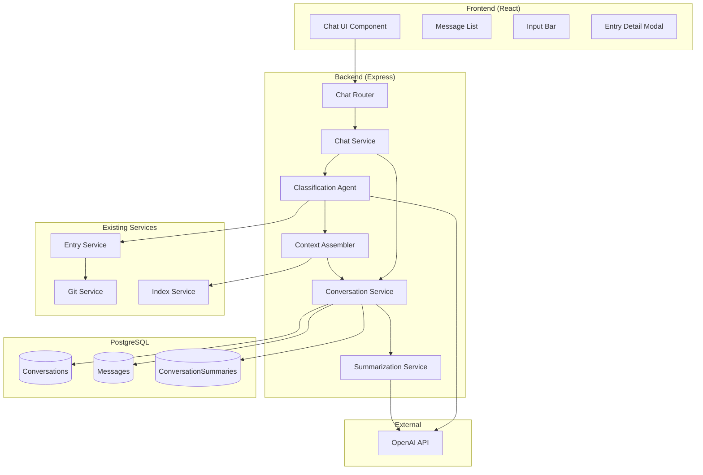

# Design Document: Chat Capture and Classification

## Overview

This design document describes the architecture and implementation of the Chat Capture and Classification feature for the JustDo.so application. The feature provides a conversational interface for capturing thoughts and an LLM-powered classification system that automatically routes entries based on confidence scores.

The system follows a tool-based agent architecture where the LLM acts as a classification agent with access to specific tools for creating, updating, and querying entries. High-confidence classifications (≥0.6) are filed directly to the appropriate category, while low-confidence classifications go to the inbox with a clarification request.

## Architecture



### Component Responsibilities

| Component | Responsibility |
|-----------|----------------|
| Chat UI | Renders conversation, handles user input, displays classification feedback |
| Chat Router | REST API endpoints for chat operations |
| Chat Service | Orchestrates message processing, classification, and response generation |
| Classification Agent | LLM-powered classification with tool execution |
| Conversation Service | CRUD operations for conversations, messages, and summaries |
| Context Assembler | Builds the context window for LLM calls |
| Summarization Service | Generates conversation summaries when threshold exceeded |

## Components and Interfaces

### Chat Service

The Chat Service orchestrates the entire message processing flow.

```typescript
interface ChatService {
  // Process a user message and return the assistant response
  processMessage(
    conversationId: string | null,
    message: string,
    hints?: string
  ): Promise<ChatResponse>;

  // Get or create a conversation
  getOrCreateConversation(channel: Channel): Promise<Conversation>;

  // Handle course correction requests
  handleCourseCorrection(
    conversationId: string,
    targetCategory: Category,
    entryPath: string
  ): Promise<CourseCorrectResponse>;
}

interface ChatResponse {
  conversationId: string;
  message: AssistantMessage;
  entry?: {
    path: string;
    category: Category;
    name: string;
    confidence: number;
  };
  clarificationNeeded: boolean;
}

interface AssistantMessage {
  id: string;
  role: 'assistant';
  content: string;
  filedEntryPath?: string;
  filedConfidence?: number;
  createdAt: Date;
}
```

### Classification Agent

The Classification Agent wraps the OpenAI API and implements the classification logic.

```typescript
interface ClassificationAgent {
  // Classify a thought and return structured result
  classify(input: ClassificationInput): Promise<ClassificationResult>;
}

interface ClassificationInput {
  text: string;
  hints?: string;
  context: ContextWindow;
}

interface ClassificationResult {
  category: 'people' | 'projects' | 'ideas' | 'admin';
  confidence: number;
  name: string;
  slug: string;
  fields: CategoryFields;
  relatedEntries: string[];
  reasoning: string;
}

type CategoryFields = 
  | PeopleFields 
  | ProjectsFields 
  | IdeasFields 
  | AdminFields;

interface PeopleFields {
  context: string;
  followUps: string[];
  relatedProjects: string[];
}

interface ProjectsFields {
  status: 'active' | 'waiting' | 'blocked' | 'someday';
  nextAction: string;
  relatedPeople: string[];
  dueDate?: string;
}

interface IdeasFields {
  oneLiner: string;
  relatedProjects: string[];
}

interface AdminFields {
  status: 'pending';
  dueDate?: string;
}
```

### Context Assembler

The Context Assembler builds the context window for LLM calls.

```typescript
interface ContextAssembler {
  // Assemble the full context window for a conversation
  assemble(conversationId: string): Promise<ContextWindow>;
}

interface ContextWindow {
  indexContent: string;
  summaries: ConversationSummary[];
  recentMessages: Message[];
  systemPrompt: string;
}
```

### Conversation Service

The Conversation Service manages conversation state in PostgreSQL.

```typescript
interface ConversationService {
  // Create a new conversation
  create(channel: Channel): Promise<Conversation>;

  // Get conversation by ID
  getById(id: string): Promise<Conversation | null>;

  // Get the most recent conversation for a channel
  getMostRecent(channel: Channel): Promise<Conversation | null>;

  // Add a message to a conversation
  addMessage(
    conversationId: string,
    role: Role,
    content: string,
    filedEntryPath?: string,
    filedConfidence?: number
  ): Promise<Message>;

  // Get messages for a conversation
  getMessages(
    conversationId: string,
    limit?: number
  ): Promise<Message[]>;

  // Get summaries for a conversation
  getSummaries(conversationId: string): Promise<ConversationSummary[]>;

  // Add a summary to a conversation
  addSummary(
    conversationId: string,
    summary: string,
    messageCount: number,
    startMessageId: string,
    endMessageId: string
  ): Promise<ConversationSummary>;

  // Get message count for a conversation
  getMessageCount(conversationId: string): Promise<number>;
}
```

### Summarization Service

The Summarization Service generates summaries when conversations exceed the threshold.

```typescript
interface SummarizationService {
  // Check if summarization is needed and perform it
  checkAndSummarize(conversationId: string): Promise<void>;

  // Generate a summary for a batch of messages
  generateSummary(messages: Message[]): Promise<string>;
}
```

### Chat Router API

```typescript
// POST /api/chat
interface ChatRequest {
  message: string;
  conversationId?: string;
  hints?: string;
}

interface ChatApiResponse {
  conversationId: string;
  message: {
    id: string;
    role: 'assistant';
    content: string;
    filedEntryPath?: string;
    filedConfidence?: number;
    createdAt: string;
  };
  entry?: {
    path: string;
    category: string;
    name: string;
    confidence: number;
  };
  clarificationNeeded: boolean;
}

// GET /api/conversations
interface ConversationsResponse {
  conversations: {
    id: string;
    channel: string;
    createdAt: string;
    updatedAt: string;
    messageCount: number;
  }[];
}

// GET /api/conversations/:id/messages
interface MessagesResponse {
  messages: {
    id: string;
    role: string;
    content: string;
    filedEntryPath?: string;
    filedConfidence?: number;
    createdAt: string;
  }[];
}
```

### Frontend Components

```typescript
// Chat UI Component Props
interface ChatUIProps {
  onEntryClick: (path: string) => void;
}

// Message Component Props
interface MessageProps {
  message: {
    id: string;
    role: 'user' | 'assistant';
    content: string;
    filedEntryPath?: string;
    filedConfidence?: number;
    createdAt: string;
  };
  onEntryClick: (path: string) => void;
}

// Input Bar Component Props
interface InputBarProps {
  onSend: (message: string) => void;
  disabled: boolean;
}

// Entry Modal Component Props
interface EntryModalProps {
  entryPath: string | null;
  onClose: () => void;
}
```

## Data Models

### Existing Prisma Models (from 001-project-setup)

The following models already exist and will be used:

```prisma
model Conversation {
  id         String    @id @default(uuid())
  channel    Channel
  externalId String?
  createdAt  DateTime  @default(now())
  updatedAt  DateTime  @updatedAt
  
  messages   Message[]
  summaries  ConversationSummary[]
}

model Message {
  id              String       @id @default(uuid())
  conversationId  String
  conversation    Conversation @relation(...)
  role            Role
  content         String
  filedEntryPath  String?
  filedConfidence Float?
  createdAt       DateTime     @default(now())
}

model ConversationSummary {
  id              String       @id @default(uuid())
  conversationId  String
  conversation    Conversation @relation(...)
  summary         String
  messageCount    Int
  startMessageId  String
  endMessageId    String
  createdAt       DateTime     @default(now())
}
```

### Classification Result Schema

The LLM returns structured JSON matching this schema:

```typescript
interface ClassificationSchema {
  category: 'people' | 'projects' | 'ideas' | 'admin';
  confidence: number;  // 0.0 to 1.0
  name: string;        // Short descriptive title
  slug: string;        // URL-safe lowercase slug
  fields: {
    // Category-specific fields
    // For people: context, follow_ups, related_projects
    // For projects: status, next_action, related_people, due_date
    // For ideas: one_liner, related_projects
    // For admin: status, due_date
  };
  related_entries: string[];  // Slugs of related entries
  reasoning: string;          // Brief explanation
}
```

### Environment Configuration

```typescript
interface ChatConfig {
  OPENAI_API_KEY: string;
  CONFIDENCE_THRESHOLD: number;      // Default: 0.6
  MAX_VERBATIM_MESSAGES: number;     // Default: 15
  SUMMARIZE_AFTER_MESSAGES: number;  // Default: 20
}
```


## Correctness Properties

*A property is a characteristic or behavior that should hold true across all valid executions of a system—essentially, a formal statement about what the system should do. Properties serve as the bridge between human-readable specifications and machine-verifiable correctness guarantees.*

### Property 1: Classification Result Structure

*For any* user input text processed by the Classification Agent, the returned result SHALL contain all required fields: category (one of people/projects/ideas/admin), confidence (number 0.0-1.0), name (non-empty string), slug (non-empty string), fields (object), and reasoning (string).

**Validates: Requirements 3.1, 3.2, 3.3**

### Property 2: Slug URL-Safety

*For any* name string provided to the slug generator, the resulting slug SHALL contain only lowercase letters, numbers, and hyphens, with no leading or trailing hyphens, and no consecutive hyphens.

**Validates: Requirements 3.5**

### Property 3: Category-Field Consistency

*For any* classification result, the fields object SHALL contain exactly the required keys for the classified category:
- people: context, followUps, relatedProjects
- projects: status, nextAction, relatedPeople (dueDate optional)
- ideas: oneLiner, relatedProjects
- admin: status (dueDate optional)

**Validates: Requirements 3.6**

### Property 4: Confidence-Based Routing

*For any* classification result with confidence score C and threshold T:
- If C >= T, the entry SHALL be created in the category folder (people/, projects/, ideas/, or admin/)
- If C < T, the entry SHALL be created in the inbox/ folder

**Validates: Requirements 4.1, 4.2**

### Property 5: Inbox Entry Structure

*For any* entry created in the inbox folder, the entry SHALL contain: original_text (the user's input), suggested_category (the classified category), confidence (the score), and status set to "needs_review".

**Validates: Requirements 4.3**

### Property 6: Course Correction Detection

*For any* user message containing phrases like "actually that should be a [category]", "move that to [category]", "file as [category]", or "that's a [category]", the system SHALL interpret this as a course correction request for the most recently filed entry.

**Validates: Requirements 6.1**

### Property 7: Entry Move Operation

*For any* course correction request specifying a target category, after the operation completes:
- The entry SHALL exist at the new path ({category}/{slug}.md)
- The entry SHALL NOT exist at the original path
- A git commit SHALL be created recording the move

**Validates: Requirements 6.2**

### Property 8: Field Transformation on Category Change

*For any* entry moved from one category to another, the entry's frontmatter SHALL be transformed to contain the required fields for the new category, preserving common fields (id, name, tags, created_at, source_channel) and adding category-specific defaults.

**Validates: Requirements 6.3**

### Property 9: Message Persistence

*For any* message (user or assistant) processed by the chat service, after processing completes:
- The message SHALL be retrievable from the database
- The message SHALL have a valid conversationId referencing an existing conversation
- The message role SHALL match the sender (user or assistant)

**Validates: Requirements 7.1, 7.2, 7.4**

### Property 10: Filed Entry Metadata

*For any* assistant message that resulted in filing an entry, the stored message SHALL contain:
- filedEntryPath matching the created entry's path
- filedConfidence matching the classification confidence score

**Validates: Requirements 7.5**

### Property 11: Context Assembly Completeness

*For any* context window assembled for a conversation, the context SHALL contain:
- The current index.md content (non-empty if entries exist)
- All conversation summaries for that conversation (in chronological order)
- The most recent N messages (where N <= MAX_VERBATIM_MESSAGES)

**Validates: Requirements 8.1, 8.2, 8.3**

### Property 12: Context Ordering

*For any* assembled context window, the components SHALL be ordered as:
1. System prompt
2. Index content
3. Conversation summaries (oldest to newest)
4. Recent messages (oldest to newest)

**Validates: Requirements 8.4**

### Property 13: Summarization Trigger

*For any* conversation where the total message count exceeds SUMMARIZE_AFTER_MESSAGES, the system SHALL create a ConversationSummary covering the oldest messages (excluding the most recent MAX_VERBATIM_MESSAGES).

**Validates: Requirements 9.1**

### Property 14: Summary Metadata Integrity

*For any* ConversationSummary created, the summary SHALL contain:
- startMessageId referencing a valid message in the conversation
- endMessageId referencing a valid message in the conversation
- messageCount equal to the number of messages between start and end (inclusive)

**Validates: Requirements 9.3**

### Property 15: Message Retention After Summarization

*For any* conversation after summarization occurs, the most recent MAX_VERBATIM_MESSAGES messages SHALL remain available verbatim (not summarized) in the context window.

**Validates: Requirements 9.5**

### Property 16: Hint Extraction and Application

*For any* user message containing a category hint in brackets (e.g., "[project]", "[person]", "[idea]", "[task]"), the hint SHALL be extracted and passed to the Classification Agent, and the resulting classification SHALL match the hinted category with confidence >= 0.8.

**Validates: Requirements 10.1**

### Property 17: API Authentication Enforcement

*For any* request to /api/chat, /api/conversations, or /api/conversations/:id/messages without a valid Bearer token, the API SHALL return a 401 Unauthorized response.

**Validates: Requirements 12.5**

### Property 18: Message Chronological Ordering

*For any* list of messages retrieved for display, the messages SHALL be ordered by createdAt timestamp in ascending order (oldest first).

**Validates: Requirements 2.1**

## Error Handling

### Classification Errors

| Error Condition | Handling Strategy |
|-----------------|-------------------|
| OpenAI API unavailable | Return error response, do not create entry, suggest retry |
| OpenAI rate limit exceeded | Queue message for retry with exponential backoff |
| Invalid JSON response from LLM | Log error, return generic classification failure message |
| Classification timeout (>30s) | Cancel request, return timeout error |

### Entry Creation Errors

| Error Condition | Handling Strategy |
|-----------------|-------------------|
| Entry already exists (slug collision) | Append numeric suffix to slug (e.g., project-name-2) |
| Git commit fails | Log error, entry still created, mark for manual git sync |
| Index regeneration fails | Log error, continue with stale index |

### Conversation Errors

| Error Condition | Handling Strategy |
|-----------------|-------------------|
| Database connection lost | Return 503 Service Unavailable, queue message for retry |
| Conversation not found | Create new conversation automatically |
| Message storage fails | Return error, do not proceed with classification |

### Course Correction Errors

| Error Condition | Handling Strategy |
|-----------------|-------------------|
| No recent entry to correct | Return helpful message explaining no recent entry found |
| Entry already in target category | Return message indicating entry is already in that category |
| Move operation fails | Return error, entry remains in original location |

### Frontend Error Handling

| Error Condition | Handling Strategy |
|-----------------|-------------------|
| Network request fails | Display error toast, enable retry button |
| WebSocket disconnection | Show reconnecting indicator, auto-reconnect with backoff |
| Entry fetch fails | Display error in modal, offer close option |

## Testing Strategy

### Unit Testing

Unit tests focus on specific examples, edge cases, and component isolation:

**Classification Agent Tests:**
- Test slug generation with various inputs (spaces, special chars, unicode)
- Test category field extraction for each category type
- Test hint parsing with various hint formats
- Test course correction intent detection patterns

**Conversation Service Tests:**
- Test message creation and retrieval
- Test summary creation with valid message ranges
- Test conversation creation for different channels

**Context Assembler Tests:**
- Test context assembly with empty conversation
- Test context assembly with messages but no summaries
- Test context assembly with both messages and summaries
- Test message limit enforcement

**Chat Service Tests:**
- Test high-confidence routing (entry created in category folder)
- Test low-confidence routing (entry created in inbox)
- Test course correction flow

### Property-Based Testing

Property tests verify universal properties across randomly generated inputs. Each property test MUST:
- Run minimum 100 iterations (using fast-check or similar)
- Reference the design document property number
- Use tag format: **Feature: chat-capture-and-classification, Property {N}: {title}**

**Property Test Implementation:**

```typescript
// Property 2: Slug URL-Safety
// Feature: chat-capture-and-classification, Property 2: Slug URL-Safety
describe('generateSlug', () => {
  it('produces URL-safe slugs for any input', () => {
    fc.assert(
      fc.property(fc.string(), (name) => {
        const slug = generateSlug(name);
        // Only lowercase letters, numbers, hyphens
        expect(slug).toMatch(/^[a-z0-9-]*$/);
        // No leading/trailing hyphens
        expect(slug).not.toMatch(/^-|-$/);
        // No consecutive hyphens
        expect(slug).not.toMatch(/--/);
      }),
      { numRuns: 100 }
    );
  });
});

// Property 4: Confidence-Based Routing
// Feature: chat-capture-and-classification, Property 4: Confidence-Based Routing
describe('confidence routing', () => {
  it('routes based on confidence threshold', () => {
    fc.assert(
      fc.property(
        fc.float({ min: 0, max: 1 }),
        fc.float({ min: 0, max: 1 }),
        (confidence, threshold) => {
          const result = determineTargetFolder(confidence, threshold);
          if (confidence >= threshold) {
            expect(result).not.toBe('inbox');
          } else {
            expect(result).toBe('inbox');
          }
        }
      ),
      { numRuns: 100 }
    );
  });
});

// Property 18: Message Chronological Ordering
// Feature: chat-capture-and-classification, Property 18: Message Chronological Ordering
describe('message ordering', () => {
  it('maintains chronological order', () => {
    fc.assert(
      fc.property(
        fc.array(fc.date(), { minLength: 1, maxLength: 50 }),
        (dates) => {
          const messages = dates.map((d, i) => ({ id: String(i), createdAt: d }));
          const sorted = sortMessagesChronologically(messages);
          for (let i = 1; i < sorted.length; i++) {
            expect(sorted[i].createdAt.getTime())
              .toBeGreaterThanOrEqual(sorted[i-1].createdAt.getTime());
          }
        }
      ),
      { numRuns: 100 }
    );
  });
});
```

### Integration Testing

Integration tests verify component interactions:

- **Chat API Integration:** Test full flow from POST /api/chat to entry creation
- **Conversation Persistence:** Test message storage and retrieval across requests
- **Summarization Integration:** Test automatic summarization when threshold exceeded
- **Course Correction Integration:** Test entry move with git commit

### Test Configuration

```typescript
// jest.config.js additions
module.exports = {
  // ... existing config
  testMatch: [
    '**/*.test.ts',
    '**/*.property.test.ts'
  ],
  setupFilesAfterEnv: ['./tests/setup.ts'],
};
```

### Test Data Generators

```typescript
// tests/generators/chat.generators.ts
import fc from 'fast-check';

export const messageArbitrary = fc.record({
  id: fc.uuid(),
  role: fc.constantFrom('user', 'assistant'),
  content: fc.string({ minLength: 1, maxLength: 1000 }),
  createdAt: fc.date(),
  filedEntryPath: fc.option(fc.string()),
  filedConfidence: fc.option(fc.float({ min: 0, max: 1 })),
});

export const classificationResultArbitrary = fc.record({
  category: fc.constantFrom('people', 'projects', 'ideas', 'admin'),
  confidence: fc.float({ min: 0, max: 1 }),
  name: fc.string({ minLength: 1, maxLength: 100 }),
  slug: fc.string({ minLength: 1, maxLength: 50 }),
  reasoning: fc.string({ minLength: 1, maxLength: 500 }),
});

export const conversationArbitrary = fc.record({
  id: fc.uuid(),
  channel: fc.constantFrom('chat', 'email', 'api'),
  createdAt: fc.date(),
  updatedAt: fc.date(),
});
```
