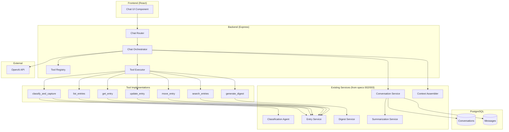
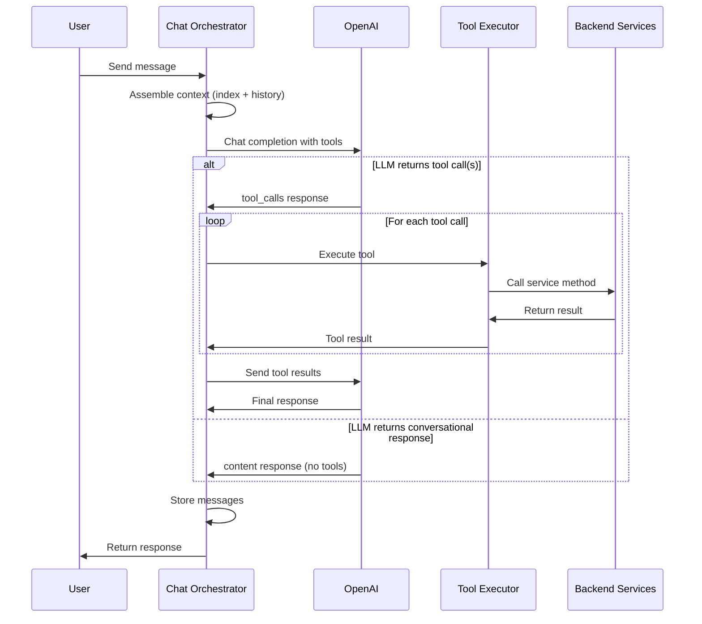

# Design Document: LLM Tool Routing

## Overview

This design document describes the architecture for implementing LLM-based tool routing in the JustDo.so chat interface. The current implementation (spec 002) uses a hardcoded flow where every message is classified and captured. This refactor introduces OpenAI function calling to let the LLM decide which tool(s) to invoke based on user intent.

The key architectural change is replacing the deterministic `processMessage` flow with an LLM-driven orchestration loop:

1. User message → LLM with tool schemas
2. LLM decides: tool call(s) or conversational response
3. If tool call: execute tool, return result to LLM
4. LLM generates final response

This enables query tools (list_entries, get_entry, search_entries), on-demand digest generation, natural course correction, and conversational responses—all through the same chat interface.

## Architecture



### Component Responsibilities

| Component | Responsibility |
|-----------|----------------|
| **Chat Orchestrator** | Main orchestration loop: sends messages to LLM with tools, handles tool calls, generates responses |
| **Tool Registry** | Defines OpenAI function calling schemas for all MVP tools |
| **Tool Executor** | Validates and executes tool calls against underlying services |
| **Classification Agent** | LLM-powered classification (existing, used by classify_and_capture tool) |
| **Entry Service** | CRUD operations for markdown entries (existing) |
| **Digest Service** | Generates daily/weekly digests (existing) |
| **Conversation Service** | Manages conversations and messages (existing) |
| **Context Assembler** | Builds context windows for LLM calls (existing) |

## Components and Interfaces

### Tool Registry

The Tool Registry defines OpenAI function calling schemas for all MVP tools.

```typescript
interface ToolDefinition {
  type: 'function';
  function: {
    name: string;
    description: string;
    parameters: {
      type: 'object';
      properties: Record<string, JsonSchema>;
      required: string[];
    };
  };
}

interface ToolRegistry {
  // Get all tool definitions for OpenAI API
  getAllTools(): ToolDefinition[];
  
  // Get a specific tool definition by name
  getTool(name: string): ToolDefinition | undefined;
  
  // Validate tool arguments against schema
  validateArguments(toolName: string, args: unknown): ValidationResult;
}

interface ValidationResult {
  valid: boolean;
  errors?: string[];
}
```

### Tool Schemas

```typescript
// classify_and_capture
{
  name: 'classify_and_capture',
  description: 'Classify a thought and create an entry in the knowledge base. Use when the user shares new information, facts, ideas, or tasks to remember.',
  parameters: {
    type: 'object',
    properties: {
      text: { type: 'string', description: 'The thought or information to capture' },
      hints: { type: 'string', description: 'Optional category hint like [project] or [person:name]' }
    },
    required: ['text']
  }
}

// list_entries
{
  name: 'list_entries',
  description: 'List entries from the knowledge base with optional filters. Use when the user asks to see, show, or list their entries.',
  parameters: {
    type: 'object',
    properties: {
      category: { type: 'string', enum: ['people', 'projects', 'ideas', 'admin', 'inbox'] },
      status: { type: 'string', description: 'Filter by status (e.g., active, pending, done)' },
      limit: { type: 'number', description: 'Maximum number of entries to return', default: 10 }
    },
    required: []
  }
}

// get_entry
{
  name: 'get_entry',
  description: 'Get the full details of a specific entry. Use when the user asks about a specific person, project, idea, or task.',
  parameters: {
    type: 'object',
    properties: {
      path: { type: 'string', description: 'The entry path (e.g., projects/clientco-integration.md)' }
    },
    required: ['path']
  }
}

// generate_digest
{
  name: 'generate_digest',
  description: 'Generate a daily digest or weekly review. Use when the user asks for their digest, summary, or review.',
  parameters: {
    type: 'object',
    properties: {
      type: { type: 'string', enum: ['daily', 'weekly'], description: 'Type of digest to generate' }
    },
    required: ['type']
  }
}

// update_entry
{
  name: 'update_entry',
  description: 'Update fields of an existing entry. Use when the user wants to modify an entry.',
  parameters: {
    type: 'object',
    properties: {
      path: { type: 'string', description: 'The entry path to update' },
      updates: { 
        type: 'object', 
        description: 'Fields to update (e.g., status, next_action, due_date)',
        additionalProperties: true
      }
    },
    required: ['path', 'updates']
  }
}

// move_entry
{
  name: 'move_entry',
  description: 'Move an entry to a different category. Use when the user wants to reclassify an entry (e.g., "actually that should be a project").',
  parameters: {
    type: 'object',
    properties: {
      path: { type: 'string', description: 'The current entry path' },
      targetCategory: { type: 'string', enum: ['people', 'projects', 'ideas', 'admin'] }
    },
    required: ['path', 'targetCategory']
  }
}

// search_entries
{
  name: 'search_entries',
  description: 'Search for entries by keyword. Use when the user wants to find entries containing specific terms.',
  parameters: {
    type: 'object',
    properties: {
      query: { type: 'string', description: 'Search query' },
      category: { type: 'string', enum: ['people', 'projects', 'ideas', 'admin', 'inbox'] },
      limit: { type: 'number', description: 'Maximum results to return', default: 10 }
    },
    required: ['query']
  }
}
```

### Chat Orchestrator

The refactored Chat Orchestrator replaces the hardcoded flow with LLM-driven tool selection.

```typescript
interface ChatOrchestrator {
  // Process a user message with LLM tool routing
  processMessage(
    conversationId: string | null,
    message: string
  ): Promise<ChatResponse>;
}

interface ChatResponse {
  conversationId: string;
  message: AssistantMessage;
  entry?: {
    path: string;
    category: Category;
    name: string;
    confidence: number;
  };
  toolsUsed?: string[];
}

interface AssistantMessage {
  id: string;
  role: 'assistant';
  content: string;
  filedEntryPath?: string;
  filedConfidence?: number;
  createdAt: Date;
}
```

### Tool Executor

The Tool Executor validates and executes tool calls.

```typescript
interface ToolExecutor {
  // Execute a tool call and return the result
  execute(toolCall: ToolCall): Promise<ToolResult>;
}

interface ToolCall {
  name: string;
  arguments: Record<string, unknown>;
}

interface ToolResult {
  success: boolean;
  data?: unknown;
  error?: string;
}

// Tool-specific result types
interface CaptureResult {
  path: string;
  category: Category;
  name: string;
  confidence: number;
  clarificationNeeded: boolean;
}

interface ListEntriesResult {
  entries: EntrySummary[];
  total: number;
}

interface GetEntryResult {
  entry: EntryWithPath;
}

interface DigestResult {
  type: 'daily' | 'weekly';
  content: string;
}

interface UpdateEntryResult {
  path: string;
  updatedFields: string[];
}

interface MoveEntryResult {
  oldPath: string;
  newPath: string;
  category: Category;
}

interface SearchResult {
  entries: SearchHit[];
  total: number;
}

interface SearchHit {
  path: string;
  name: string;
  category: Category;
  matchedField: string;
  snippet: string;
}
```

### Search Service

New service for full-text search across entries.

```typescript
interface SearchService {
  // Search entries by query
  search(query: string, options?: SearchOptions): Promise<SearchResult>;
}

interface SearchOptions {
  category?: Category;
  limit?: number;
}

interface SearchResult {
  entries: SearchHit[];
  total: number;
}
```

## Data Models

### OpenAI API Types

```typescript
// OpenAI chat completion request with tools
interface ChatCompletionRequest {
  model: string;
  messages: ChatMessage[];
  tools?: ToolDefinition[];
  tool_choice?: 'auto' | 'none' | { type: 'function'; function: { name: string } };
}

// OpenAI chat completion response
interface ChatCompletionResponse {
  choices: {
    message: {
      role: 'assistant';
      content: string | null;
      tool_calls?: {
        id: string;
        type: 'function';
        function: {
          name: string;
          arguments: string; // JSON string
        };
      }[];
    };
    finish_reason: 'stop' | 'tool_calls';
  }[];
}

// Tool call result message
interface ToolResultMessage {
  role: 'tool';
  tool_call_id: string;
  content: string; // JSON string of result
}
```

### System Prompt Template

```typescript
const SYSTEM_PROMPT = `You are a personal knowledge management assistant for a JustDo.so application. You help the user capture thoughts, retrieve information, and stay organized.

You have access to these tools:
- classify_and_capture: Use when the user shares new information to remember (facts, ideas, tasks, people info)
- list_entries: Use when the user asks to see/show/list their entries
- get_entry: Use when the user asks about a specific entry
- generate_digest: Use when the user asks for their daily digest or weekly review
- update_entry: Use when the user wants to modify an existing entry
- move_entry: Use when the user wants to reclassify an entry (e.g., "actually that should be a project")
- search_entries: Use when the user wants to find entries by keyword

Guidelines:
- When the user shares a new thought, fact, or idea → use classify_and_capture
- When the user asks to see, list, or find entries → use list_entries or search_entries
- When the user asks for their digest → use generate_digest
- When the user wants to correct a recent classification → use move_entry with the most recent entry path
- When the user is just chatting (greetings, questions about the system) → respond conversationally without tools

Current knowledge base index:
{indexContent}

Recent conversation:
{conversationHistory}`;
```

## Orchestration Flow




## Correctness Properties

*A property is a characteristic or behavior that should hold true across all valid executions of a system—essentially, a formal statement about what the system should do. Properties serve as the bridge between human-readable specifications and machine-verifiable correctness guarantees.*

Based on the prework analysis, the following properties have been identified for property-based testing:

### Property 1: Tool Schema Validity

*For any* tool in the Tool Registry, the tool definition SHALL contain:
- A non-empty `name` string
- A non-empty `description` string (at least 20 characters explaining when to use the tool)
- A `parameters` object with `type: 'object'` and a `properties` object
- A `required` array (may be empty)

**Validates: Requirements 1.2, 1.4, 1.5**

### Property 2: List Entries Filtering

*For any* call to list_entries with a category filter, all returned entries SHALL have a category matching the filter. *For any* call with a status filter, all returned entries SHALL have a status matching the filter. *For any* call with a limit, the number of returned entries SHALL be at most the limit value.

**Validates: Requirements 3.2**

### Property 3: Get Entry Round-Trip

*For any* valid entry path in the knowledge base, calling get_entry SHALL return an entry object where the path matches the requested path and the entry data matches what is stored on disk.

**Validates: Requirements 3.3**

### Property 4: Update Entry Application

*For any* valid entry path and update object, after calling update_entry, reading the entry SHALL show the updated fields with the new values, while preserving fields not included in the update.

**Validates: Requirements 3.5**

### Property 5: Move Entry Path Change

*For any* valid entry path and target category, after calling move_entry:
- The entry SHALL exist at the new path `{targetCategory}/{slug}.md`
- The entry SHALL NOT exist at the original path
- The entry's frontmatter SHALL be transformed to match the target category schema

**Validates: Requirements 3.6**

### Property 6: Search Results Filtering and Relevance

*For any* search query:
- All returned entries SHALL contain the query string in at least one of: name, one_liner, context, or content
- If a category filter is provided, all results SHALL be in that category
- If a limit is provided, results.length SHALL be at most the limit
- Results SHALL be sorted by relevance (entries with more matches appear first)

**Validates: Requirements 3.7, 7.1, 7.2, 7.3, 7.4**

### Property 7: System Prompt Completeness

*For any* assembled system prompt, the prompt SHALL contain:
- A role description mentioning "knowledge management assistant"
- References to all 7 tool names
- Guidelines for when to use each tool type
- The current index.md content (or placeholder if empty)
- Conversation history section

**Validates: Requirements 6.1, 6.2, 6.3, 6.4, 6.5, 6.6, 6.7, 6.8**

### Property 8: Message Metadata Persistence

*For any* tool execution that creates an entry (classify_and_capture), the stored assistant message SHALL contain:
- `filedEntryPath` matching the created entry's path
- `filedConfidence` matching the classification confidence score

**Validates: Requirements 8.3**

### Property 9: Confidence-Based Routing Preservation

*For any* classification result with confidence score C and threshold T (default 0.6):
- If C >= T, the entry SHALL be created in the classified category folder
- If C < T, the entry SHALL be created in the inbox folder

This property ensures backward compatibility with spec 002's routing behavior.

**Validates: Requirements 8.1**

## Error Handling

### Tool Execution Errors

| Error Scenario | Handling |
|----------------|----------|
| Tool not found in registry | Return error to LLM: "Unknown tool: {name}" |
| Invalid tool arguments | Return validation errors to LLM |
| Entry not found (get_entry, update_entry, move_entry) | Return error to LLM: "Entry not found: {path}" |
| Entry already exists at target path (move_entry) | Append numeric suffix to slug |
| Search query empty | Return empty results array |
| Classification fails | Return error to LLM, do not create entry |

### OpenAI API Errors

| Error Scenario | Handling |
|----------------|----------|
| API unavailable | Return 503 to client with retry suggestion |
| Rate limit exceeded | Queue with exponential backoff, return 429 |
| Invalid response format | Log error, return generic error message |
| Timeout (>30s) | Cancel request, return timeout error |
| Tool call with invalid JSON arguments | Parse error, return to LLM for correction |

### Orchestration Errors

| Error Scenario | Handling |
|----------------|----------|
| Conversation not found | Create new conversation |
| Context assembly fails | Use minimal context (system prompt only) |
| Message storage fails | Log error, still return response to user |
| Summarization fails | Log warning, continue without summarization |

## Testing Strategy

### Unit Tests

Unit tests focus on specific examples and component isolation:

**Tool Registry Tests:**
- Verify all 7 MVP tools are defined
- Verify each tool has valid schema structure
- Test argument validation for each tool

**Tool Executor Tests:**
- Test each tool execution with valid inputs
- Test error handling for invalid inputs
- Test integration with underlying services (mocked)

**Search Service Tests:**
- Test search with various query patterns
- Test category filtering
- Test limit enforcement
- Test empty results case

**System Prompt Tests:**
- Verify prompt contains all required sections
- Test with empty index
- Test with conversation history

### Property-Based Tests

Property tests use fast-check library with the following configuration based on workspace guidelines:

| Property | Test Focus | numRuns |
|----------|------------|---------|
| 1 | Tool schema structure validation | 3 (all 7 tools) |
| 2 | List entries filtering | 5 |
| 3 | Get entry round-trip | 5 |
| 4 | Update entry application | 5 |
| 5 | Move entry path change | 5 |
| 6 | Search filtering and relevance | 10 |
| 7 | System prompt completeness | 3 |
| 8 | Message metadata persistence | 5 |
| 9 | Confidence routing | 10 |

**Test Tags Format**: `Feature: llm-tool-routing, Property {N}: {property_title}`

### Integration Tests

Integration tests verify the full orchestration flow:

1. **Tool Selection Flow** - Mock OpenAI to return specific tool calls, verify execution
2. **Conversational Flow** - Mock OpenAI to return no tools, verify direct response
3. **Multi-Tool Flow** - Mock OpenAI to return multiple tool calls, verify sequential execution
4. **Error Recovery Flow** - Force tool failures, verify error propagation to LLM

### Test Data Generators

```typescript
// Tool call generator
const toolCallArbitrary = fc.record({
  name: fc.constantFrom(
    'classify_and_capture', 'list_entries', 'get_entry',
    'generate_digest', 'update_entry', 'move_entry', 'search_entries'
  ),
  arguments: fc.dictionary(fc.string(), fc.jsonValue())
});

// Category generator
const categoryArbitrary = fc.constantFrom('people', 'projects', 'ideas', 'admin', 'inbox');

// Entry path generator
const entryPathArbitrary = fc.tuple(
  fc.constantFrom('people', 'projects', 'ideas', 'admin', 'inbox'),
  fc.string({ minLength: 1, maxLength: 30 }).map(s => s.toLowerCase().replace(/[^a-z0-9]/g, '-'))
).map(([cat, slug]) => `${cat}/${slug}.md`);

// Search query generator
const searchQueryArbitrary = fc.string({ minLength: 1, maxLength: 50 });

// Confidence score generator
const confidenceArbitrary = fc.float({ min: 0, max: 1, noNaN: true });
```

## Migration Strategy

### Phase 1: Add New Components (Non-Breaking)

1. Create `tool-registry.ts` with all tool schemas
2. Create `tool-executor.ts` with tool implementations
3. Create `search.service.ts` for full-text search
4. Add new tests for new components

### Phase 2: Refactor Chat Orchestrator

1. Create new `processMessageWithTools()` method in ChatService
2. Keep existing `processMessage()` as fallback
3. Add feature flag `USE_TOOL_ROUTING` (default: false)
4. Test both paths in parallel

### Phase 3: Switch Over

1. Enable `USE_TOOL_ROUTING` by default
2. Remove hardcoded course correction regex patterns
3. Deprecate old `processMessage()` method
4. Update API documentation

### Phase 4: Cleanup

1. Remove deprecated methods
2. Remove feature flag
3. Update all tests to use new flow
