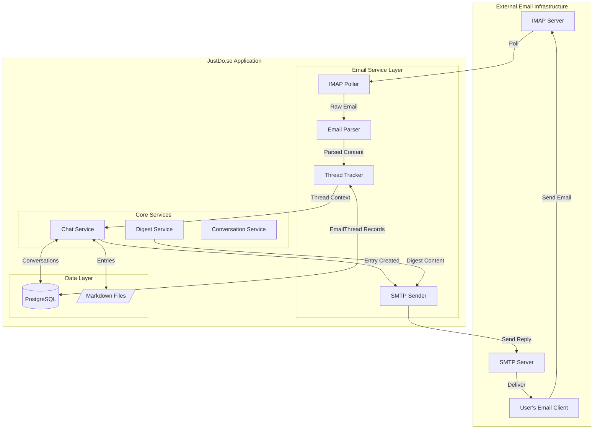
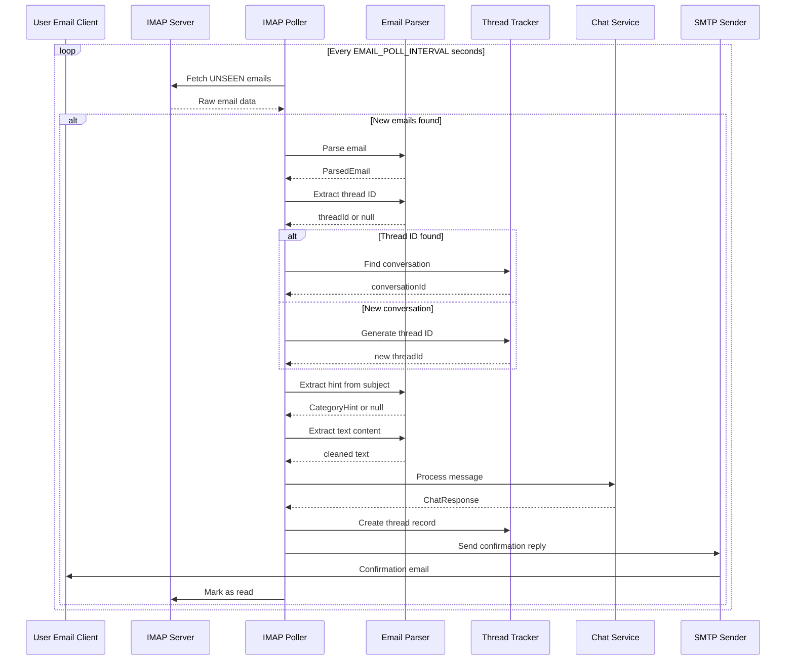
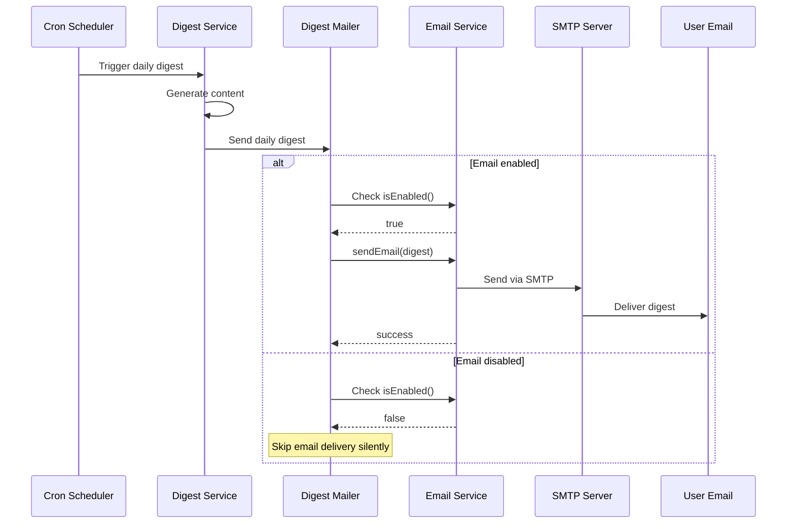

# Design Document: Email Channel

## Overview

The email channel provides bidirectional communication with the JustDo.so application via standard email protocols. Users can capture thoughts by sending emails to a configured address, receive confirmation replies, and engage in threaded conversations for course corrections. The system also delivers scheduled digests via email.

The implementation uses:
- **Nodemailer** for SMTP outbound email delivery
- **node-imap** for IMAP inbound email polling
- **mailparser** for parsing email content (extracting text, headers, etc.)

The email channel is designed as an optional feature that gracefully degrades when not configured.

## Architecture



## Components and Interfaces

### EmailConfig Interface

```typescript
interface EmailConfig {
  smtp: {
    host: string;
    port: number;
    user: string;
    pass: string;
    secure: boolean;
  } | null;
  imap: {
    host: string;
    user: string;
    pass: string;
    port: number;
    tls: boolean;
  } | null;
  pollInterval: number; // seconds
  enabled: boolean;
}
```

### EmailService Class

The main service coordinating all email operations.

```typescript
interface IEmailService {
  // Check if email is enabled
  isEnabled(): boolean;
  
  // Send an email
  sendEmail(options: SendEmailOptions): Promise<SendEmailResult>;
  
  // Send a reply to an existing thread
  sendReply(threadId: string, content: string, subject?: string): Promise<SendEmailResult>;
  
  // Process a single inbound email
  processInboundEmail(email: ParsedEmail): Promise<ProcessResult>;
  
  // Start the IMAP polling loop
  startPolling(): void;
  
  // Stop the IMAP polling loop
  stopPolling(): void;
}

interface SendEmailOptions {
  to: string;
  subject: string;
  text: string;
  html?: string;
  inReplyTo?: string;
  references?: string[];
}

interface SendEmailResult {
  success: boolean;
  messageId?: string;
  error?: string;
}

interface ProcessResult {
  success: boolean;
  conversationId?: string;
  entryPath?: string;
  error?: string;
}
```

### ImapPoller Class

Handles periodic polling of the IMAP server for new emails.

```typescript
interface IImapPoller {
  // Start polling at configured interval
  start(): void;
  
  // Stop polling
  stop(): void;
  
  // Check if currently polling
  isRunning(): boolean;
  
  // Manually trigger a poll (for testing)
  pollNow(): Promise<PollResult>;
}

interface PollResult {
  emailsFound: number;
  emailsProcessed: number;
  errors: string[];
}
```

### EmailParser Class

Parses raw email content into structured data.

```typescript
interface IEmailParser {
  // Parse raw email source
  parse(source: Buffer | string): Promise<ParsedEmail>;
  
  // Extract plain text from email (handles HTML fallback)
  extractText(email: ParsedEmail): string;
  
  // Extract category hint from subject
  extractHint(subject: string): CategoryHint | null;
  
  // Extract thread ID from subject or body
  extractThreadId(subject: string, body: string): string | null;
}

interface ParsedEmail {
  messageId: string;
  inReplyTo?: string;
  references?: string[];
  from: EmailAddress;
  to: EmailAddress[];
  subject: string;
  text?: string;
  html?: string;
  date: Date;
}

interface EmailAddress {
  address: string;
  name?: string;
}

interface CategoryHint {
  category: 'people' | 'projects' | 'ideas' | 'admin';
  originalText: string;
}
```

### ThreadTracker Class

Manages thread identification and conversation linking.

```typescript
interface IThreadTracker {
  // Generate a new thread ID
  generateThreadId(): string;
  
  // Find conversation by thread ID
  findConversation(threadId: string): Promise<string | null>;
  
  // Create thread record linking email to conversation
  createThread(params: CreateThreadParams): Promise<EmailThread>;
  
  // Get thread by Message-ID
  getByMessageId(messageId: string): Promise<EmailThread | null>;
  
  // Format thread ID for inclusion in emails
  formatThreadId(threadId: string): string;
}

interface CreateThreadParams {
  messageId: string;
  threadId: string;
  inReplyTo?: string;
  subject: string;
  fromAddress: string;
  conversationId: string;
}

interface EmailThread {
  id: string;
  messageId: string;
  threadId: string;
  inReplyTo?: string;
  subject: string;
  fromAddress: string;
  conversationId: string;
  createdAt: Date;
}
```

### DigestMailer Class

Handles email delivery of digests.

```typescript
interface IDigestMailer {
  // Send daily digest via email
  sendDailyDigest(content: string): Promise<SendEmailResult>;
  
  // Send weekly review via email
  sendWeeklyReview(content: string): Promise<SendEmailResult>;
  
  // Check if email delivery is available
  isAvailable(): boolean;
}
```

## Data Models

### EmailThread (Existing Prisma Model)

The EmailThread model is already defined in the schema:

```prisma
model EmailThread {
  id             String   @id @default(uuid())
  messageId      String   @unique  // Email Message-ID header
  threadId       String            // Our [SB-{uuid}] identifier
  inReplyTo      String?           // Parent email Message-ID
  subject        String
  fromAddress    String
  conversationId String            // Links to Conversation
  createdAt      DateTime @default(now())
  
  @@index([threadId])
  @@index([conversationId])
}
```

### Thread ID Format

Thread identifiers follow the format `[SB-{shortUuid}]` where shortUuid is the first 8 characters of a UUID v4:

```
[SB-a1b2c3d4]
```

This format is:
- Short enough to not clutter subject lines
- Unique enough to avoid collisions
- Easy to parse with regex: `/\[SB-([a-f0-9]{8})\]/i`

### Email Content Structure

Outbound confirmation emails follow this structure:

```
Subject: Re: {original_subject} [SB-{threadId}]

{confirmation_message}

---
Thread ID: [SB-{threadId}]
Reply to this email to continue the conversation.
```

The thread ID appears in both the subject and footer to handle email clients that strip or modify subjects.


## Sequence Diagrams

### Inbound Email Processing



### Outbound Digest Delivery



## Configuration

### Environment Variables

The email channel uses these environment variables (all optional):

| Variable | Description | Default |
|----------|-------------|---------|
| `SMTP_HOST` | SMTP server hostname | - |
| `SMTP_PORT` | SMTP server port | 587 |
| `SMTP_USER` | SMTP authentication username | - |
| `SMTP_PASS` | SMTP authentication password | - |
| `IMAP_HOST` | IMAP server hostname | - |
| `IMAP_USER` | IMAP authentication username | - |
| `IMAP_PASS` | IMAP authentication password | - |
| `EMAIL_POLL_INTERVAL` | Polling interval in seconds | 60 |

### Configuration Loading

```typescript
function loadEmailConfig(): EmailConfig {
  const smtpHost = process.env.SMTP_HOST;
  const imapHost = process.env.IMAP_HOST;
  
  // Email is enabled only if both SMTP and IMAP are configured
  const smtpConfigured = !!(smtpHost && process.env.SMTP_USER && process.env.SMTP_PASS);
  const imapConfigured = !!(imapHost && process.env.IMAP_USER && process.env.IMAP_PASS);
  
  return {
    smtp: smtpConfigured ? {
      host: smtpHost!,
      port: parseInt(process.env.SMTP_PORT || '587', 10),
      user: process.env.SMTP_USER!,
      pass: process.env.SMTP_PASS!,
      secure: parseInt(process.env.SMTP_PORT || '587', 10) === 465
    } : null,
    imap: imapConfigured ? {
      host: imapHost!,
      user: process.env.IMAP_USER!,
      pass: process.env.IMAP_PASS!,
      port: 993,
      tls: true
    } : null,
    pollInterval: parseInt(process.env.EMAIL_POLL_INTERVAL || '60', 10),
    enabled: smtpConfigured && imapConfigured
  };
}
```

## Email Content Parsing

### Subject Line Parsing

Category hints are extracted from subject lines using bracket notation:

```typescript
const HINT_PATTERN = /^\[(person|project|idea|task)\]\s*/i;

function extractHint(subject: string): CategoryHint | null {
  const match = subject.match(HINT_PATTERN);
  if (!match) return null;
  
  const hintText = match[1].toLowerCase();
  const categoryMap: Record<string, Category> = {
    'person': 'people',
    'project': 'projects',
    'idea': 'ideas',
    'task': 'admin'
  };
  
  return {
    category: categoryMap[hintText],
    originalText: match[0]
  };
}
```

### Thread ID Extraction

```typescript
const THREAD_ID_PATTERN = /\[SB-([a-f0-9]{8})\]/i;

function extractThreadId(subject: string, body: string): string | null {
  // Try subject first
  let match = subject.match(THREAD_ID_PATTERN);
  if (match) return match[1];
  
  // Fall back to body
  match = body.match(THREAD_ID_PATTERN);
  return match ? match[1] : null;
}
```

### Body Text Extraction

```typescript
function extractText(email: ParsedEmail): string {
  let text = email.text || '';
  
  // If no plain text, strip HTML
  if (!text && email.html) {
    text = stripHtml(email.html);
  }
  
  // Remove quoted replies (lines starting with >)
  text = text.split('\n')
    .filter(line => !line.trim().startsWith('>'))
    .join('\n');
  
  // Remove signature (after -- or ___)
  const signaturePatterns = [/^-- $/m, /^___+$/m, /^---+$/m];
  for (const pattern of signaturePatterns) {
    const match = text.match(pattern);
    if (match && match.index !== undefined) {
      text = text.substring(0, match.index);
    }
  }
  
  // Remove our thread ID footer
  text = text.replace(/---\s*Thread ID:.*$/s, '');
  
  return text.trim();
}
```


## Correctness Properties

*A property is a characteristic or behavior that should hold true across all valid executions of a system—essentially, a formal statement about what the system should do. Properties serve as the bridge between human-readable specifications and machine-verifiable correctness guarantees.*

### Property 1: Configuration Loading Consistency

*For any* set of valid email environment variables, loading the configuration SHALL produce an EmailConfig object where all provided values are correctly mapped to their respective fields.

**Validates: Requirements 1.1, 1.2, 1.3**

### Property 2: Graceful Degradation with Missing Configuration

*For any* combination of missing email environment variables (SMTP_HOST, SMTP_USER, SMTP_PASS, IMAP_HOST, IMAP_USER, IMAP_PASS), the EmailConfig SHALL have `enabled: false` and the application SHALL not throw an error.

**Validates: Requirements 1.4**

### Property 3: Subject Hint Extraction

*For any* email subject containing a category hint in bracket notation (`[person]`, `[project]`, `[idea]`, `[task]`), the Subject_Parser SHALL extract the correct category. For subjects without hints, the parser SHALL return null.

**Validates: Requirements 2.2**

### Property 4: Thread ID Format Consistency

*For any* generated thread identifier, it SHALL match the format `[SB-{8 hex characters}]` and be unique across multiple generations.

**Validates: Requirements 3.1**

### Property 5: Thread ID Presence in Confirmation Emails

*For any* confirmation email sent in response to an inbound email, the thread identifier SHALL appear in both the subject line and the email body footer.

**Validates: Requirements 3.2, 5.4**

### Property 6: Thread ID Extraction with Fallback

*For any* email where the thread ID is present only in the body (not in subject), the Thread_Tracker SHALL successfully extract the thread ID from the body.

**Validates: Requirements 3.3, 3.4**

### Property 7: Confirmation Email Content Based on Confidence

*For any* entry created from an inbound email:
- The confirmation email SHALL include the entry name, category, and confidence score
- IF confidence is below threshold, THEN the confirmation SHALL include clarification instructions
- The email SHALL include the correct In-Reply-To header referencing the original email

**Validates: Requirements 5.2, 5.3, 5.5**

### Property 8: Digest Email Formatting

*For any* digest type (daily or weekly), the formatted email SHALL:
- Have a subject indicating the digest type
- Contain the full digest content in the body
- NOT have an In-Reply-To header (new thread)

**Validates: Requirements 6.2, 6.3, 6.4**

### Property 9: Email Body Text Extraction and Cleaning

*For any* email content (plain text, HTML, or mixed):
- Plain text SHALL be preferred over HTML when both are available
- HTML tags SHALL be stripped when only HTML is available
- Email signatures (after `-- `, `___`, `---`) SHALL be removed
- Quoted reply content (lines starting with `>`) SHALL be removed
- The result SHALL be trimmed of leading/trailing whitespace

**Validates: Requirements 2.3, 8.1, 8.2, 8.3, 8.4, 8.5**

## Error Handling

### IMAP Connection Errors

```typescript
class ImapConnectionError extends Error {
  constructor(message: string, public readonly originalError?: Error) {
    super(`IMAP connection failed: ${message}`);
    this.name = 'ImapConnectionError';
  }
}
```

When IMAP connection fails:
1. Log the error with details
2. Leave emails unprocessed (will retry on next poll)
3. Continue application operation (don't crash)

### SMTP Send Errors

```typescript
class SmtpSendError extends Error {
  constructor(message: string, public readonly originalError?: Error) {
    super(`SMTP send failed: ${message}`);
    this.name = 'SmtpSendError';
  }
}
```

When SMTP send fails:
1. Log the error with details
2. Return failure result (don't throw)
3. Entry creation continues unaffected

### Email Parsing Errors

```typescript
class EmailParseError extends Error {
  constructor(message: string, public readonly originalError?: Error) {
    super(`Email parsing failed: ${message}`);
    this.name = 'EmailParseError';
  }
}
```

When email parsing fails:
1. Log the error with email Message-ID
2. Leave email unread for manual review
3. Continue processing other emails

### Configuration Errors

When email configuration is incomplete:
1. Log warning at startup indicating which variables are missing
2. Set `enabled: false` in EmailConfig
3. All email operations return gracefully without attempting connections

## Testing Strategy

### Unit Tests

Unit tests focus on pure functions and isolated logic:

1. **Configuration Loading**
   - Test with all variables set
   - Test with partial variables (SMTP only, IMAP only)
   - Test with no variables
   - Test with invalid values (non-numeric port)

2. **Subject Parsing**
   - Test each hint type: `[person]`, `[project]`, `[idea]`, `[task]`
   - Test case insensitivity: `[PERSON]`, `[Person]`
   - Test with no hint
   - Test with hint in middle of subject (should not match)

3. **Thread ID Operations**
   - Test generation format
   - Test extraction from subject
   - Test extraction from body (fallback)
   - Test with no thread ID present

4. **Body Text Extraction**
   - Test plain text extraction
   - Test HTML stripping
   - Test signature removal with various delimiters
   - Test quote removal
   - Test combined scenarios

5. **Confirmation Message Formatting**
   - Test high confidence entry
   - Test low confidence entry (inbox routing)
   - Test thread ID inclusion

### Property-Based Tests

Property tests validate universal properties across many generated inputs:

1. **Property 3: Subject Hint Extraction**
   - Generate random subjects with/without hints
   - Verify extraction correctness
   - Tag: **Feature: 006-email-channel, Property 3: Subject hint extraction**

2. **Property 4: Thread ID Format**
   - Generate many thread IDs
   - Verify format compliance
   - Verify uniqueness
   - Tag: **Feature: 006-email-channel, Property 4: Thread ID format consistency**

3. **Property 6: Thread ID Extraction Fallback**
   - Generate emails with thread ID in various positions
   - Verify extraction works from subject and body
   - Tag: **Feature: 006-email-channel, Property 6: Thread ID extraction with fallback**

4. **Property 9: Email Body Text Extraction**
   - Generate emails with various content types
   - Verify cleaning rules are applied
   - Tag: **Feature: 006-email-channel, Property 9: Email body text extraction and cleaning**

### Integration Tests

Integration tests verify component interactions:

1. **IMAP Polling** (requires test IMAP server or mock)
   - Test successful email fetch
   - Test connection failure handling
   - Test marking emails as read

2. **SMTP Sending** (requires test SMTP server or mock)
   - Test successful send
   - Test send failure handling
   - Test reply threading (In-Reply-To header)

3. **End-to-End Flow**
   - Receive email → Process → Send confirmation
   - Reply with course correction → Process → Send confirmation

### Test Configuration

Property-based tests should use `{ numRuns: 3 }` per workspace guidelines for database operations, and `{ numRuns: 5-10 }` for pure parsing functions.

```typescript
// Example property test structure
describe('EmailParser', () => {
  // Feature: 006-email-channel, Property 3: Subject hint extraction
  it('extracts category hints from any valid subject', () => {
    fc.assert(
      fc.property(
        fc.constantFrom('person', 'project', 'idea', 'task'),
        fc.string(),
        (hint, rest) => {
          const subject = `[${hint}] ${rest}`;
          const result = extractHint(subject);
          expect(result).not.toBeNull();
          expect(result?.category).toBe(hintToCategory(hint));
        }
      ),
      { numRuns: 10 }
    );
  });
});
```
