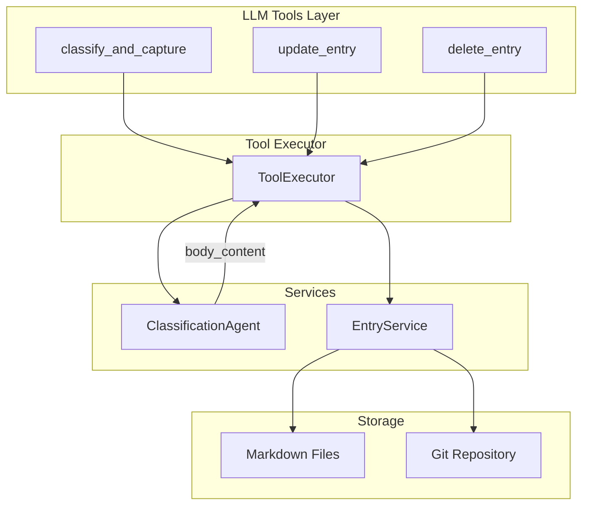
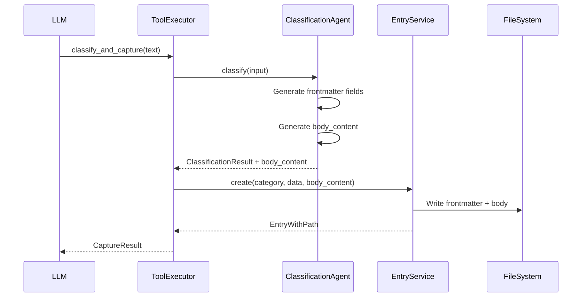

# Design Document: Entry Content Management

## Overview

This design extends the JustDo.so entry management system to support full markdown content (body content) in addition to frontmatter metadata. The current implementation only stores structured data in YAML frontmatter, but the product vision shows entries should have rich body content like Notes, Logs, and Elaboration sections.

The design covers three main capabilities:
1. **Body content generation** - The Classification Agent generates appropriate body content during entry creation
2. **Body content editing** - The update_entry tool supports modifying entry body content
3. **Entry deletion** - A new delete_entry tool allows removing entries via LLM

## Architecture



### Data Flow: Entry Creation with Body Content



## Components and Interfaces

### 1. ClassificationResult Enhancement

The `ClassificationResult` interface is extended to include body content:

```typescript
// backend/src/types/chat.types.ts

export interface ClassificationResult {
  category: 'people' | 'projects' | 'ideas' | 'admin';
  confidence: number;
  name: string;
  slug: string;
  fields: CategoryFields;
  relatedEntries: string[];
  reasoning: string;
  bodyContent: string;  // NEW: Generated markdown body content
}
```

### 2. Classification Agent Prompt Enhancement

The classification prompt is updated to instruct the LLM to generate body content:

```typescript
// Classification schema update
const CLASSIFICATION_SCHEMA = `{
  "category": "people" | "projects" | "ideas" | "admin",
  "confidence": 0.0-1.0,
  "name": "Short descriptive title",
  "slug": "url-safe-lowercase-slug",
  "fields": { ... },
  "related_entries": ["slug1", "slug2"],
  "reasoning": "Brief explanation",
  "body_content": "Markdown body content with appropriate sections"
}`;
```

Body content generation guidelines by category:
- **people**: `## Notes` section with observations, preferences, communication style
- **projects**: `## Notes` for context, `## Log` for timeline entries
- **ideas**: `## Elaboration` expanding on the concept
- **admin**: `## Notes` only if input has context beyond the task itself

### 3. EntryService.create() Enhancement

The create method accepts optional body content:

```typescript
// backend/src/services/entry.service.ts

async create(
  category: Category, 
  data: CreateEntryInput, 
  channel?: Channel,
  bodyContent?: string  // NEW parameter
): Promise<EntryWithPath>
```

The method uses `gray-matter` to serialize both frontmatter and body:

```typescript
// Current: matter.stringify('', entry)
// New: matter.stringify(bodyContent || '', entry)
```

### 4. EntryService.update() Enhancement

The update method accepts body content modifications:

```typescript
// backend/src/services/entry.service.ts

export interface BodyContentUpdate {
  content: string;
  mode: 'append' | 'replace' | 'section';
  section?: string;  // Required when mode is 'section'
}

async update(
  path: string, 
  updates: UpdateEntryInput, 
  channel: Channel = 'api',
  bodyUpdate?: BodyContentUpdate  // NEW parameter
): Promise<EntryWithPath>
```

Body update modes:
- **append**: Add content to end of existing body
- **replace**: Replace entire body with new content
- **section**: Append to a specific section (creates section if missing)

### 5. update_entry Tool Schema Enhancement

```typescript
// backend/src/services/tool-registry.ts

{
  type: 'function',
  function: {
    name: 'update_entry',
    description: 'Update fields or body content of an existing entry...',
    parameters: {
      type: 'object',
      properties: {
        path: { type: 'string', description: 'The entry path to update' },
        updates: { type: 'object', description: 'Frontmatter fields to update' },
        body_content: {
          type: 'object',
          description: 'Body content modification',
          properties: {
            content: { type: 'string', description: 'Content to add/replace' },
            mode: { 
              type: 'string', 
              enum: ['append', 'replace', 'section'],
              description: 'How to apply the content'
            },
            section: { 
              type: 'string', 
              description: 'Section name for section mode (e.g., Notes, Log)'
            }
          },
          required: ['content', 'mode']
        }
      },
      required: ['path']
    }
  }
}
```

### 6. delete_entry Tool Definition

```typescript
// backend/src/services/tool-registry.ts

{
  type: 'function',
  function: {
    name: 'delete_entry',
    description: 'Delete an entry from the knowledge base. Use when the user explicitly asks to remove, delete, or get rid of an entry.',
    parameters: {
      type: 'object',
      properties: {
        path: {
          type: 'string',
          description: 'The entry path to delete (e.g., admin/grocery-shopping.md)'
        }
      },
      required: ['path']
    }
  }
}
```

### 7. ToolExecutor.handleDeleteEntry()

```typescript
// backend/src/services/tool-executor.ts

export interface DeleteEntryResult {
  path: string;
  name: string;
  category: Category;
}

private async handleDeleteEntry(args: Record<string, unknown>): Promise<ToolResult> {
  const path = args.path as string;
  
  // Read entry first to get name for response
  const existing = await this.entryService.read(path);
  const category = existing.category;
  const name = category === 'inbox' 
    ? (existing.entry as InboxEntry).suggested_name 
    : (existing.entry as BaseEntry).name;
  
  // Delete the entry
  await this.entryService.delete(path, 'api');
  
  return {
    success: true,
    data: { path, name, category } as DeleteEntryResult
  };
}
```

## Data Models

### Entry File Format

Entries are stored as markdown files with YAML frontmatter:

```markdown
---
id: uuid
name: "Entry Name"
tags: []
created_at: '2026-01-27T10:00:00.000Z'
updated_at: '2026-01-27T10:00:00.000Z'
source_channel: api
confidence: 0.85
# ... category-specific fields
---

## Notes

- First observation
- Second observation

## Log

- 2026-01-27: Initial creation
```

### Section Conventions by Category

| Category | Primary Section | Optional Sections |
|----------|----------------|-------------------|
| people | Notes | - |
| projects | Notes | Log |
| ideas | Elaboration | Notes |
| admin | Notes | - |

### Log Entry Format

When appending to a Log section, entries are formatted with the current date:

```markdown
## Log

- 2026-01-27: Received API documentation
- 2026-01-28: Completed initial integration
```

## Correctness Properties

*A property is a characteristic or behavior that should hold true across all valid executions of a system—essentially, a formal statement about what the system should do. Properties serve as the bridge between human-readable specifications and machine-verifiable correctness guarantees.*


Based on the prework analysis, the following properties are testable:

### Property 1: Entry Creation with Body Content Round-Trip

*For any* valid entry data and non-empty body content string, creating an entry with body content and then reading it back SHALL return both the original frontmatter fields and the body content unchanged.

**Validates: Requirements 1.6**

### Property 2: Body Append Preserves Existing Content

*For any* existing entry with body content and any new content string, updating with mode "append" SHALL result in the final body containing the original content followed by the new content.

**Validates: Requirements 2.2**

### Property 3: Body Replace Overwrites Content

*For any* existing entry with body content and any new content string, updating with mode "replace" SHALL result in the final body containing only the new content.

**Validates: Requirements 2.3**

### Property 4: Section Append Adds to Correct Section

*For any* existing entry and any section name and content, updating with mode "section" SHALL result in the content appearing under the specified section header. If the section did not exist, it SHALL be created.

**Validates: Requirements 2.4, 2.5**

### Property 5: Log Entries Get Date Prefix

*For any* entry and any content string, appending to the "Log" section SHALL prepend the current date in YYYY-MM-DD format to the content.

**Validates: Requirements 2.6**

### Property 6: Body Updates Preserve Frontmatter

*For any* existing entry and any body content update (append, replace, or section mode), the frontmatter fields SHALL remain unchanged except for `updated_at`.

**Validates: Requirements 2.7**

## Error Handling

### EntryService Errors

| Error | Condition | Response |
|-------|-----------|----------|
| `EntryNotFoundError` | Path does not exist | Tool returns `{ success: false, error: "Entry not found: {path}" }` |
| `EntryAlreadyExistsError` | Create with existing slug | Tool returns error (existing behavior) |
| `InvalidEntryDataError` | Invalid category or data | Tool returns validation error |

### delete_entry Error Cases

1. **Entry not found**: Returns `{ success: false, error: "Entry not found: {path}" }`
2. **Invalid path format**: Returns `{ success: false, error: "Invalid path format" }`
3. **Git commit failure**: Logs error, entry still deleted, returns success with warning

### update_entry Body Content Errors

1. **Invalid mode**: Schema validation rejects non-enum values
2. **Section mode without section name**: Returns `{ success: false, error: "Section name required for section mode" }`
3. **Entry not found**: Returns `{ success: false, error: "Entry not found: {path}" }`

## Testing Strategy

### Unit Tests

Unit tests focus on specific examples and edge cases:

1. **EntryService.create() with body content**
   - Creates file with both frontmatter and body
   - Handles empty body content gracefully
   - Preserves markdown formatting in body

2. **EntryService.update() body modes**
   - Append mode concatenates content
   - Replace mode overwrites content
   - Section mode finds/creates sections
   - Log section gets date prefix

3. **delete_entry tool**
   - Returns correct response format
   - Handles non-existent entries
   - Triggers index regeneration

4. **Tool Registry**
   - delete_entry tool is registered
   - update_entry schema includes body_content

### Property-Based Tests

Property tests validate universal properties using `fast-check` with `{ numRuns: 3 }` per workspace guidelines:

1. **Entry creation round-trip** (Property 1)
   - Generate random frontmatter and body content
   - Create entry, read back, verify equality

2. **Body append preserves content** (Property 2)
   - Generate random existing body and new content
   - Verify final body = original + new

3. **Body replace overwrites** (Property 3)
   - Generate random existing body and new content
   - Verify final body = new content only

4. **Section append correctness** (Property 4)
   - Generate random section names and content
   - Verify content appears under correct header

5. **Log date prefix** (Property 5)
   - Generate random log content
   - Verify date prefix format

6. **Frontmatter preservation** (Property 6)
   - Generate random frontmatter and body updates
   - Verify frontmatter unchanged (except updated_at)

### Test Configuration

- Property tests use `{ numRuns: 3 }` per workspace guidelines
- Each property test references its design document property
- Tag format: `Feature: entry-content-management, Property N: {property_text}`
