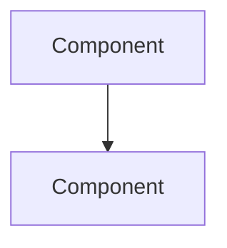

# Design Document Diagrams

Use Mermaid diagrams for all visual representations in design documents.

**Supported diagram types:**
- `flowchart` - Architecture, component relationships
- `sequenceDiagram` - Data flow, API interactions
- `erDiagram` - Database schemas
- `classDiagram` - Class/interface relationships

**Format:**
```markdown

```

❌ Never use ASCII art diagrams
✅ Always use Mermaid for renderability
